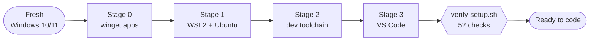
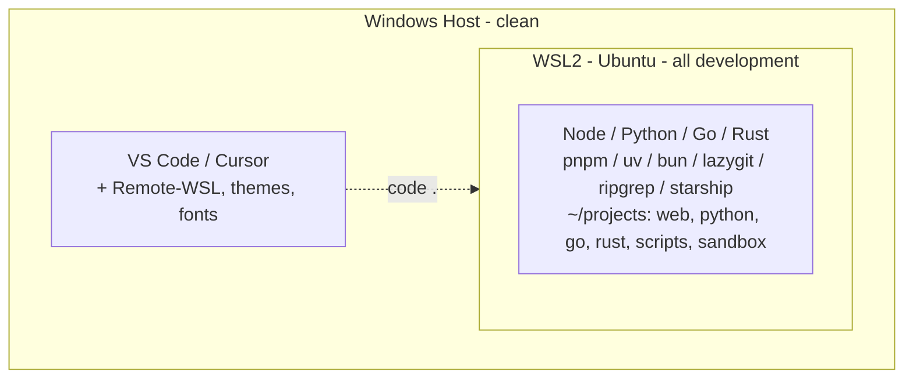

# wsl2-devkit

> One-evening, production-grade dev environment for **Windows 10 (2004+)** and **Windows 11** — a clean Windows host with all your development isolated in WSL2 Ubuntu.


<p align="center">
  
  <br>
  <sub><i>Illustrative walkthrough — Stages 1–2 reproduced for pacing; the finale is real eza / git / lazygit.</i></sub>
</p>

wsl2-devkit provisions a fresh machine in four staged scripts: baseline Windows apps, WSL2 + Ubuntu, the full Linux dev toolchain, and VS Code — then hands you a one-command **health check** to prove it all worked.

**Design principle:** Windows stays clean. Editors, browsers and fonts live on Windows; every language runtime, linter and CLI tool lives in WSL2, where your code runs fast.

---

## How it works





---

## Repository layout

```
wsl2-devkit/
├── windows/                  # run from Windows PowerShell
│   ├── stage0-winget.ps1     # (optional) baseline Windows apps + Nerd Font
│   ├── stage1-windows.ps1    # enable WSL2 + install Ubuntu  (Admin)
│   ├── stage3-vscode.ps1     # VS Code extensions + settings
│   └── wsl-tools.ps1         # backup / restore / clean / update / reset
├── wsl/                      # run inside Ubuntu (WSL)
│   ├── stage2-ubuntu.sh      # dev toolchain + shell config
│   └── verify-setup.sh       # read-only health check
├── docs/
│   └── DOCUMENTATION.md      # full reference guide
├── demo/                     # VHS demo (make demo)
│   ├── devkit-demo.tape      # walkthrough script
│   ├── devkit-demo.gif       # rendered hero GIF (shown above)
│   └── lib/                  # stage reproductions used by the walkthrough
├── Makefile                  # make verify / lint / demo / help  (run in WSL)
├── CHANGELOG.md
└── LICENSE
```

---

## Quick start

| Stage | Script | Where | Time |
|:-----:|--------|-------|:----:|
| 0 | `windows/stage0-winget.ps1` | PowerShell | ~5 min |
| 1 | `windows/stage1-windows.ps1` | PowerShell **(Admin)** | ~5 min |
| — | *Restart, then create your Ubuntu user* | — | ~3 min |
| 2 | `wsl/stage2-ubuntu.sh` | Ubuntu terminal | ~10–15 min |
| 3 | `windows/stage3-vscode.ps1` | PowerShell | ~5 min |
| ✓ | `wsl/verify-setup.sh` | Ubuntu terminal | ~10 sec |

**Total: ~30 minutes.** Stages run in order; each is idempotent (safe to re-run).

### Stage 0 — Windows apps *(optional, recommended)*
Installs browser, editor, Windows Terminal, Git, PowerToys, gsudo and the
JetBrainsMono Nerd Font (so WSL CLI icons render). Self-elevates; skips anything
already installed.
```powershell
powershell -ExecutionPolicy Bypass -File .\windows\stage0-winget.ps1
```

### Stage 1 — WSL2 + Ubuntu *(Admin)*
```powershell
Set-ExecutionPolicy RemoteSigned -Scope CurrentUser
.\windows\stage1-windows.ps1
# If it asks for a restart: reboot, then run it once more.
# Ubuntu installs on the second run, once the WSL features are active.
```
Then open **Ubuntu** from the Start menu and create your username + password.

### Stage 2 — Dev toolchain *(in Ubuntu)*
Clone this repo inside WSL (or copy `wsl/stage2-ubuntu.sh` into your home dir), then:
```bash
chmod +x stage2-ubuntu.sh
./stage2-ubuntu.sh          # interactive: pick Node / Python / Go / Rust
exec $SHELL -l              # reload your shell afterwards
```

### Stage 3 — VS Code *(back in PowerShell)*
Installs UI extensions on Windows and pushes the workspace extensions into the
WSL server.
```powershell
.\windows\stage3-vscode.ps1
```

### Verify
```bash
bash wsl/verify-setup.sh    # or: make verify
```
A green report means the machine is healthy; it exits non-zero if any required
tool, shell hook, directory or credential is missing.

---

## What you get

**Languages** — Node.js (LTS via nvm) + pnpm + bun · Python (pyenv) + uv + pipx · Go (official) · Rust (rustup, optional)

**Modern CLI** — eza · bat · ripgrep · fd · fzf · lazygit · zoxide · starship · gh · shellcheck

**Security** — Ed25519 SSH key · optional GPG signing key · sensible git defaults

**VS Code** — curated extensions installed into the WSL remote (language servers, linters, formatters, debuggers) with themes/Remote clients kept local

**Project scaffolding helpers**
```bash
newweb myapp    # React + Vite + TypeScript
newpy myapp     # Python + venv (uv)
newgo myapp     # Go module
newrust myapp   # Rust crate
```

---

## Daily workflow

From the Ubuntu terminal — always work under `~/projects`, then open the folder
in your editor over Remote-WSL:

```bash
cd ~/projects/web/my-app
code .            # open in VS Code (connected to WSL)
cursor .          # ...or Cursor
```

Handy aliases configured by Stage 2:

| Alias | Does |
|-------|------|
| `p` / `projects` | `cd ~/projects` |
| `mkcd <dir>` | make a directory and `cd` into it |
| `z` / `zi` | smart `cd` (zoxide) / interactive pick |
| `lg` | `lazygit` |
| `gs` / `gl` | `git status -sb` / pretty `git log` |
| `gp` / `gpl` | `git push` / `git pull` |
| `ll` / `lt` | `eza -la --icons --git` / `eza --tree --level=2` |
| `ni` / `nd` / `nb` | `pnpm install` / `dev` / `build` |
| `venv` / `activate` | create + activate / activate a Python venv |
| `reload` | `source ~/.bashrc` |

Full command and alias reference: [docs/DOCUMENTATION.md](docs/DOCUMENTATION.md).

---

## Maintenance

```powershell
.\windows\wsl-tools.ps1 status    # versions, disk usage, config
.\windows\wsl-tools.ps1 backup    # export distro (keeps 3 newest)
.\windows\wsl-tools.ps1 restore   # restore from a backup (validated)
.\windows\wsl-tools.ps1 clean     # clear caches + compact the VHD
.\windows\wsl-tools.ps1 update    # update WSL + apt packages
.\windows\wsl-tools.ps1 reset     # nuke + reinstall (typed confirmation)
```

From WSL, `make help` lists the health-check and lint targets.

> **Work in `~/projects`, not `/mnt/c/...`** — the Windows filesystem is slow across the WSL boundary.

---

## Security & trust

These scripts run with your privileges — Stage 1 needs Administrator, and the WSL
stages write your shell config, generate keys, and install toolchains. Read the
code in [windows/](windows/) and [wsl/](wsl/) before running it. What it does and
doesn't do:

- **No telemetry, no analytics, no phone-home.** Nothing is uploaded anywhere.
- **Keys stay local.** The Ed25519 SSH key and optional GPG signing key are
  generated on your machine and never leave it — you paste the *public* half into
  GitHub yourself.
- **Downloads are over TLS from official sources.** apt uses Ubuntu's signed
  repos; the Go tarball is **SHA256-verified** before install; the language
  installers (nvm, pyenv, uv, bun, rustup, starship, zoxide) are the vendors'
  official scripts fetched with `--proto '=https' --tlsv1.2`. Versions are pinned
  where an upstream publishes stable checksums; otherwise the latest signed
  release is used.
- **Idempotent and network-tolerant.** Every stage is safe to re-run — the managed
  `~/.bashrc` block is replaced (not duplicated) between markers, and a flaky
  network on any single download degrades to a warning instead of aborting the run.

## Requirements

- Windows 10 version 2004 (build 19041) or later, or Windows 11
- Virtualization enabled in firmware (for WSL2)
- Administrator access for Stage 1

## Documentation

Full reference — every setting, the staging rationale, and troubleshooting — lives in [docs/DOCUMENTATION.md](docs/DOCUMENTATION.md). Version history is in [CHANGELOG.md](CHANGELOG.md).

## License

[MIT](LICENSE)

---

<p align="center"><sub>Built with ❤️ by Eliran Cohen</sub></p>
