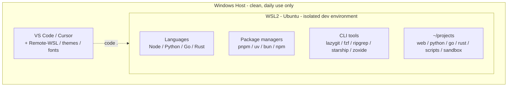
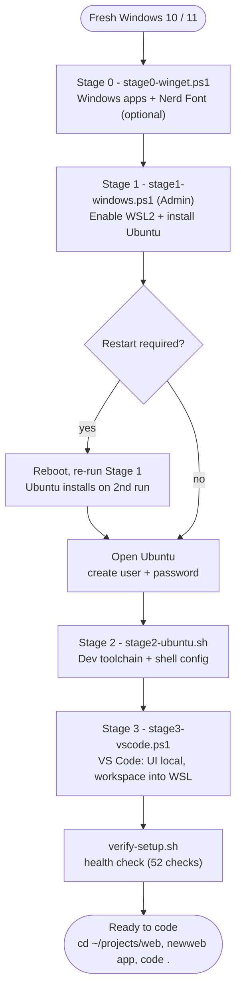

# wsl2-devkit — Reference Documentation

> **Version history:** see [CHANGELOG.md](../CHANGELOG.md).

A complete, production-grade development environment for **Windows 10 (version 2004+)** and **Windows 11** with isolated WSL2.

---

## System Requirements

| Requirement | Minimum |
|-------------|---------|
| **OS** | Windows 10 version 2004 (Build 19041) or Windows 11 |
| **RAM** | 8GB (16GB+ recommended) |
| **Disk** | 20GB free (50GB+ recommended) |
| **CPU** | 64-bit with virtualization support |

---

## Overview



> **Windows stays clean.** Editors, browsers and fonts live on Windows; every
> runtime, linter and CLI tool lives in WSL2, where your code runs fast.

---

## Scripts Included

| File | Purpose | Run Where |
|------|---------|-----------|
| `windows/stage0-winget.ps1` | Install Windows apps + JetBrainsMono Nerd Font (optional Stage 0) | PowerShell (self-elevates) |
| `windows/stage1-windows.ps1` | Install WSL2 + Ubuntu + Configuration | PowerShell (Admin) |
| `wsl/stage2-ubuntu.sh` | Install dev tools (interactive selection) | Ubuntu Terminal |
| `windows/stage3-vscode.ps1` | Install extensions + settings | PowerShell |
| `windows/wsl-tools.ps1` | Backup, restore, maintenance | PowerShell |
| `wsl/verify-setup.sh` | Health check - confirm everything installed correctly | Ubuntu Terminal |

---

## Quick Start

| Stage | Script | Time |
|-------|--------|------|
| 0 | `stage0-winget.ps1` (optional: Windows apps) | 5 min |
| 1 | `stage1-windows.ps1` | 5 min |
| - | *Restart, re-run Stage 1 (installs Ubuntu), create Ubuntu user* | 3 min |
| 2 | `stage2-ubuntu.sh` | 10-15 min |
| 3 | `stage3-vscode.ps1` | 5 min |

**Total: ~30 minutes**

---

# Script 1: `stage1-windows.ps1`

## What It Does

| Action | Details |
|--------|---------|
| **Pre-flight checks** | Windows version (Build 19041+), RAM, disk space, Admin rights |
| **Install WSL2** | Enables required Windows features |
| **Install Ubuntu** | Downloads and installs Ubuntu automatically |
| **Create `.wslconfig`** | Limits resources based on your system |
| **Create folders** | `WSL-Backups` and `WSL-Reference` |

## Automatic Resource Limits

The script detects your system specs and configures WSL accordingly:

| System RAM | WSL Memory | WSL CPUs |
|------------|------------|----------|
| 8GB | 4GB | Half of cores (min 2) |
| 16GB | 6GB | Half of cores (min 2) |
| 32GB+ | 10GB | Half of cores (min 2) |

## Generated `.wslconfig`

```ini
[wsl2]
memory=6GB              # Based on your RAM
processors=4            # Half of your cores (min 2)
swap=4GB
guiApplications=false   # Saves resources
pageReporting=false     # Better performance
networkingMode=mirrored # Win 11 22H2+ only (Win 10 uses default NAT)
dnsTunneling=true       # Win 11 22H2+ only
autoProxy=true          # Win 11 22H2+ only

[experimental]
autoMemoryReclaim=gradual  # Auto-releases memory
sparseVhd=true             # Saves disk space
```

On Windows 10 the `networkingMode`/`dnsTunneling`/`autoProxy` lines are omitted
(default NAT networking is used instead). The file is written BOM-free as ASCII,
and an existing `.wslconfig` you created yourself is left untouched.

## How to Run

```powershell
# Right-click PowerShell → Run as Administrator
Set-ExecutionPolicy RemoteSigned -Scope CurrentUser
.\stage1-windows.ps1
```

**Note:** On a fresh system this script runs **twice**. The first run enables the
required Windows features and prompts for a restart (it does *not* install Ubuntu
yet). After rebooting, run it again (as Administrator) to install Ubuntu. If WSL
features are already enabled, the single run installs Ubuntu directly.

---

# Script 2: `stage2-ubuntu.sh`

## Interactive Selection Menu

```
Select what to install:

Languages & Runtimes:
   Install Node.js? (nvm + pnpm + bun) [Y/n]: 
   Install Python? (pyenv + uv) [Y/n]: 
   Install Go? (pinned official release) [Y/n]: 
   Install Rust? (rustup) [y/N]: 

Tools:
   Install modern CLI tools? (eza, bat, ripgrep, fzf, lazygit, gh, starship) [Y/n]: 
   Install Docker CLI? (without Docker Desktop) [y/N]: 

Security:
   Setup GPG for signed commits? [y/N]: 
   Protect GPG key with a passphrase? (recommended) [y/N]: 
```

**Note:** `[Y/n]` = Default Yes (press Enter to install), `[y/N]` = Default No

## Always Installed (Regardless of Selection)

| Component | Details |
|-----------|---------|
| **Build essentials** | gcc, make, cmake, curl, wget, jq, htop, tree |
| **Git** | With configuration and aliases |
| **SSH Key** | Ed25519 + config for GitHub/GitLab |
| **Directories** | `~/projects/{web,python,go,rust,scripts,sandbox}` |

## Node.js (If Selected)

| Tool | Description |
|------|-------------|
| **nvm** | Node version manager |
| **Node LTS** | Latest stable version |
| **pnpm** | Fast package manager (2x faster than npm) |
| **bun** | Ultra-fast runtime (10x faster than npm) |
| **typescript, ts-node, tsx, create-vite** | Global tools |

### Node.js Aliases

```bash
ni           # pnpm install
na           # pnpm add
nr           # pnpm run
nd           # pnpm dev
nb           # pnpm build
newweb NAME  # Create React+Vite+TypeScript project
```

## Python (If Selected)

| Tool | Description |
|------|-------------|
| **pyenv** | Python version manager |
| **Python 3.12.x** | Latest patch release, set as default |
| **uv** | Ultra-fast package manager (100x faster than pip) |
| **ruff** | Fast linter |
| **black** | Code formatter |
| **ipython** | Enhanced interactive shell |

### Python Aliases

```bash
py           # python
venv         # uv venv && source .venv/bin/activate
activate     # source .venv/bin/activate
newpy NAME   # Create Python project with venv
```

## Go (If Selected)

| Tool | Description |
|------|-------------|
| **Go** | Pinned release from go.dev, SHA256-verified against an in-repo checksum |
| **gopls** | Language server |
| **delve** | Debugger |
| **golangci-lint** | Linter |

### Go Aliases

```bash
newgo NAME   # Create Go module
```

## Rust (If Selected)

| Tool | Description |
|------|-------------|
| **rustup** | Rust toolchain installer |
| **rustc** | Rust compiler |
| **cargo** | Package manager |

### Rust Aliases

```bash
newrust NAME  # Create Rust crate (cargo new)
```

## Modern CLI Tools (If Selected)

| Tool | Replaces | Why Better |
|------|----------|------------|
| **eza** | ls | Icons, colors, git status |
| **bat** | cat | Syntax highlighting |
| **ripgrep** | grep | 10x faster |
| **fd** | find | Simpler, faster |
| **fzf** | - | Fuzzy finder for everything |
| **zoxide** | cd | Learns your habits |
| **lazygit** | git CLI | Full TUI for git |
| **starship** | bash prompt | Beautiful and informative |
| **shellcheck** | - | Lints shell scripts |

### CLI Tools Aliases

```bash
ls           # eza --icons
ll           # eza -la --icons --git
la           # eza -a --icons
lt           # eza --tree --level=2 --icons
cat          # bat --style=plain
lg           # lazygit
z PARTIAL    # zoxide (smart cd)
```

## SSH Key Generated

```
~/.ssh/
├── id_ed25519       # Private key (keep secret)
├── id_ed25519.pub   # Public key (add to GitHub)
└── config           # Pre-configured for GitHub/GitLab
```

## GPG Signing (If Selected)

- Creates Ed25519 key for commit signing
- You choose: passphrase-protected (recommended, prompts on first sign per session)
  or unprotected (fully automatic, but anyone with access to your WSL user can sign as you)
- Configures Git to sign commits automatically
- Displays public key to add to GitHub

## How to Run

```bash
# Copy file to: \\wsl.localhost\Ubuntu\home\USERNAME\
chmod +x stage2-ubuntu.sh
./stage2-ubuntu.sh
```

### Non-Interactive Mode

For unattended provisioning (golden images, CI, repeatable rebuilds):

| Invocation | Behavior |
|------------|----------|
| `./stage2-ubuntu.sh --yes` | The menu's defaults: Node, Python, Go, CLI tools on; Rust, Docker, GPG off |
| `./stage2-ubuntu.sh --all` | Everything on (the GPG key is generated **without** a passphrase — pinentry needs a TTY; protect it later with `gpg --passwd`) |
| `./stage2-ubuntu.sh --profile FILE` | `--yes` baseline, then `FILE` is sourced for overrides (e.g. `INSTALL_RUST=true`, `SETUP_GPG=false`) |

Git identity resolves from existing `git config --global`, else the `GIT_NAME`
and `GIT_EMAIL` environment variables; the run fails fast if neither is set.
This is the same path CI uses to smoke-test the kit on every push.

---

# Script 3: `stage3-vscode.ps1`

Extensions install in two places, because VS Code splits them by where they run:

- **UI extensions** (themes, icon packs, the Remote-WSL / Remote-SSH clients)
  install on the **Windows** side and stay there.
- **Workspace extensions** (language servers, linters, formatters, debuggers,
  Git tooling - Python, Go, Rust, ESLint, Prettier, ruff, etc.) only work when
  installed inside the WSL remote, so the script installs them **only** into the
  WSL server (via that server's headless `code-server --install-extension`) and
  deliberately *not* on Windows - a local copy would be inert clutter you'd have
  to clean off later.

> **Two-run note.** The WSL push only works once VS Code has provisioned the WSL
> server, which happens the first time you open a WSL folder. On a **fresh**
> machine Stage 3 usually runs *before* that, so the workspace extensions have
> nowhere to land yet; the script installs the UI extensions on Windows, then
> prints an instruction to open Ubuntu, run `code .` once (to create the
> server), and **re-run this script** to complete the WSL-side install. It does
> not claim the remote install succeeded when it didn't.
>
> Why not just `wsl code --install-extension`? In a plain WSL shell `code`
> resolves to the Windows launcher via interop - it installs *locally* and still
> returns exit 0, a false "remote success". The Windows CLI has no `--remote`
> flag, and the server's `remote-cli/code` needs a live editor terminal's IPC
> socket. `code-server --install-extension` is the only method that reliably
> targets the remote from a detached script.

The script first verifies that Stage 2 (`stage2-ubuntu.sh`) completed before it
promises the `newweb`/`newpy`/`newgo`/`newrust` helpers exist.

## Interactive Selection Menu

```
Select extension categories to install:

   Install Python extensions? [Y/n]: 
   Install Go extensions? [Y/n]: 
   Install Rust extensions? (rust-analyzer, LLDB debugger) [y/N]: 
   Install JavaScript/React extensions? [Y/n]: 
   Install AI extensions? (Claude, Copilot) [Y/n]: 
   Install DevOps extensions? (Docker, YAML, K8s) [y/N]: 
```

## Always Installed Extensions

| Category | Extensions |
|----------|------------|
| **Core** | WSL, Remote SSH |
| **Git** | GitLens, Git Graph |
| **Code Quality** | Error Lens, Prettier, EditorConfig, Code Spell Checker |
| **Productivity** | Path Intellisense, Todo Tree, Project Manager, DotENV |
| **Themes** | Material Icons, GitHub Theme |
| **Scripting** | PowerShell, Makefile Tools, ShellCheck, Shell Format |
| **Docs** | Markdown All in One, YAML |

## Optional Extensions by Category

### Python Extensions
- Python (Microsoft)
- Pylance
- Black Formatter
- Ruff
- Debugpy
- Jupyter

### Go Extensions
- Go (Google)

### Rust Extensions
- rust-analyzer (language server, clippy on save)
- CodeLLDB (debugger)
- Even Better TOML (Cargo.toml)

### JavaScript/React Extensions
- ESLint
- ES7+ React Snippets
- Auto Rename Tag
- Simple React Snippets
- Styled Components
- Import Cost
- Tailwind CSS
- Live Server
- CSS Peek
- Color Highlight

### AI Extensions
- Claude Code (Anthropic)
- GitHub Copilot
- GitHub Copilot Chat

### DevOps Extensions
- Docker
- Even Better TOML
- Kubernetes

## Settings Applied

Key settings configured automatically:

```json
{
    "editor.formatOnSave": true,
    "editor.defaultFormatter": "esbenp.prettier-vscode",
    "terminal.integrated.defaultProfile.windows": "Ubuntu",
    "files.eol": "\n",
    
    "[python]": {
        "editor.defaultFormatter": "charliermarsh.ruff",
        "editor.tabSize": 4
    },
    
    "[typescript]": {
        "editor.defaultFormatter": "esbenp.prettier-vscode",
        "editor.tabSize": 2
    },
    
    "tailwindCSS.emmetCompletions": true
}
```

## Templates Created

```
%USERPROFILE%\WSL-Reference\templates\
├── .prettierrc      # Prettier configuration
├── .editorconfig    # Editor configuration
└── .gitignore       # Standard gitignore
```

## How to Run

```powershell
# Install VSCode or Cursor first
.\stage3-vscode.ps1
```

---

# Script 4: `wsl-tools.ps1`

## Available Commands

| Command | Description |
|---------|-------------|
| `.\wsl-tools.ps1 status` | Show versions, disk usage, settings |
| `.\wsl-tools.ps1 backup` | Create a distro backup (rotates, keeping the 3 newest per distro) |
| `.\wsl-tools.ps1 restore` | Restore from a backup (type the exact distro name to confirm) |
| `.\wsl-tools.ps1 clean` | Clean caches and compact disk |
| `.\wsl-tools.ps1 update` | Update WSL and Ubuntu packages |
| `.\wsl-tools.ps1 reset` | Delete everything and start fresh (type `DELETE` to confirm) |

## Example: `status`

```
WSL Version:
   WSL: 2.0.9.0
   Kernel: 5.15.133.1

Distributions:
   NAME      STATE    VERSION
   Ubuntu    Running  2

Disk Usage:
   ext4.vhdx: 12.5 GB

Resource Limits (.wslconfig):
   memory=6GB
   processors=4
```

## Example: `backup`

```
Distribution: Ubuntu
Backup file: C:\Users\YOU\WSL-Backups\Ubuntu-20250119-120000.tar

Shutting down WSL...
Creating backup (this may take several minutes)...

[OK] Backup created: Ubuntu-20250119-120000.tar
Size: 8.2 GB
Duration: 3.5 minutes
```

## Example: `clean`

```
This will:
   1. Clear apt cache
   2. Remove unused packages
   3. Clear temp files
   4. Compact virtual disk

Continue? (y/n): y

Cleaning apt cache...
Removing unused packages...
Clearing temp files...
Compacting virtual disk...

[OK] Disk compacted: 15.2 GB -> 12.1 GB (saved 3.1 GB)
```

---

# Installation Flow



---

# Daily Usage

## Opening Projects

```bash
# From Ubuntu terminal
cd ~/projects/web/my-app
code .      # Opens in VSCode
cursor .    # Opens in Cursor
```

## Creating New Projects

```bash
# React + TypeScript + Vite
newweb myapp

# Python with virtual environment
newpy myapp

# Go module
newgo myapp

# Rust crate
newrust myapp
```

## Quick Aliases Reference

**Navigation**

| Alias | Command | Description |
|-------|---------|-------------|
| `p` / `projects` | `cd ~/projects` | Go to projects |
| `..` / `...` | `cd ..` / `cd ../..` | Up one / two dirs |
| `mkcd <dir>` | `mkdir -p && cd` | Make dir and enter it |
| `z` / `zi` | `zoxide` | Smart cd / interactive pick |

**Files**

| Alias | Command | Description |
|-------|---------|-------------|
| `ls` | `eza --icons` | List with icons |
| `ll` | `eza -la --icons --git` | Long list, all, git status |
| `la` | `eza -a --icons` | List all (incl. dotfiles) |
| `lt` | `eza --tree --level=2` | Tree view |
| `cat` | `bat --style=plain` | Syntax highlighting |

**Git**

| Alias | Command | Description |
|-------|---------|-------------|
| `g` | `git` | Git shorthand |
| `gs` | `git status -sb` | Short git status |
| `gl` | `git lg` | Pretty git log |
| `gp` / `gpl` | `git push` / `git pull` | Push / pull |
| `lg` | `lazygit` | Git TUI |

**Node / pnpm**

| Alias | Command | Description |
|-------|---------|-------------|
| `ni` | `pnpm install` | Install packages |
| `na` | `pnpm add` | Add a package |
| `nr` | `pnpm run` | Run a script |
| `nd` | `pnpm dev` | Run dev server |
| `nb` | `pnpm build` | Build |

**Python**

| Alias | Command | Description |
|-------|---------|-------------|
| `py` | `python` | Python shorthand |
| `venv` | `uv venv` + activate | Create + activate venv |
| `activate` | `source .venv/bin/activate` | Activate existing venv |

**Scaffolding & shell**

| Alias | Command | Description |
|-------|---------|-------------|
| `newweb <name>` | React + Vite + TS | New web project |
| `newpy <name>` | Python + uv venv | New Python project |
| `newgo <name>` | Go module | New Go project |
| `newrust <name>` | Cargo crate | New Rust crate |
| `reload` | `source ~/.bashrc` | Reload shell config |
| `c` | `clear` | Clear terminal |

---

# File Access

| From | Path |
|------|------|
| Ubuntu terminal | `~/projects` |
| Windows Explorer | `\\wsl.localhost\Ubuntu\home\USERNAME\projects` |
| VSCode/Cursor | Open via `code .` in Ubuntu terminal |

**Important:** Always work in `~/projects`, NOT `/mnt/c/...` (slow!)

---

# Troubleshooting

## WSL Not Starting
```powershell
wsl --shutdown
wsl
```

## Out of Disk Space
```powershell
.\wsl-tools.ps1 clean
```

## Extensions Not Working
1. Make sure you're connected to WSL (green indicator bottom-left)
2. In the Extensions panel, click **Install in WSL: Ubuntu** for any extension
   that didn't auto-sync

## Reset Everything
```powershell
.\wsl-tools.ps1 reset
# Then run stage2-ubuntu.sh again
```

---

# Resources

- [WSL Documentation](https://learn.microsoft.com/en-us/windows/wsl/)
- [JetBrains Mono Font](https://www.jetbrains.com/lp/mono/) (Recommended)
- [Starship Prompt](https://starship.rs/)
- [pnpm](https://pnpm.io/)
- [uv](https://github.com/astral-sh/uv)

---

**Happy Coding! 🚀**
